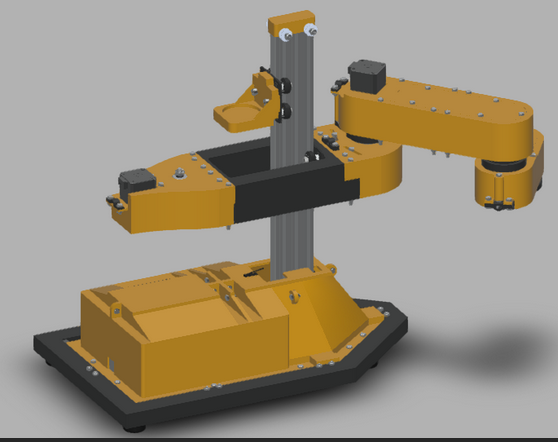

# Robot-ISCARA
To repozytorium projektu Robot ISCARA. 
## ISCARA
Czyli inaczej inverse-SCARA. To co różni naszego robota od zwykłego SCARA jest to, że człon postępowy znajduje się na początku naszego łańcucha kinematycznego, a nie jak w robotach SCARA na końcu. 

## Części mechaniczne

## Części elektroniczne
## Oprogramowanie
### Arduino
Plik `Robot-ISCARA/Software/Arduino/Communication/communication.ino` należy wgrać na arduino.
### GUI App
#### Usage
Repozytorium zawiera program zrobiony przy użyciu biblioteki Qt. Aby uruchomić program należy pobrać repozytorium, lub sam folder `Robot-ISCARA/Software/Qt/`, a następnie uruchomić projekt w Qt Creator wybierając plik `Robot-ISCARA/Software/Qt/CmakeLists.txt`. Następnie wystarczy zbudować i uruchomić program.
### Wygląd

### Funkcjonalności
Program pozwala na komunikację z Arduino po wybranym porcie, a następnie na wysyłanie komend w zdefiniowanym formacie, w terminalu.

```txt
#<NAZWA_FUNKCJI>#ARG1# [...] #ARGN#
np.
#MOVE#12#34#56#10#  
```
Komenda pozwalająca na ruch robota: 
- 12 mm w osi x 
- 34 mm w osi y 
- 56 mm w osi z
- obrót o 10 stopni
